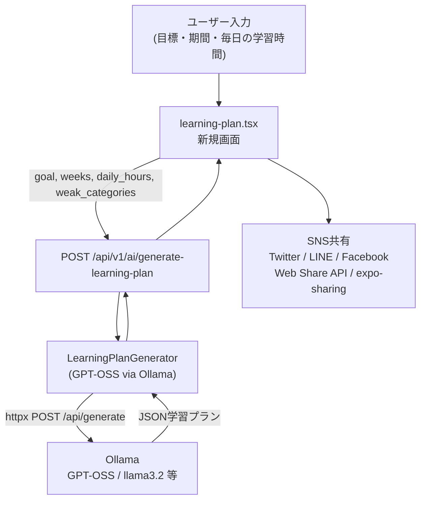

# AI学習プラン生成・SNS共有機能

## 概要

既存の Ollama + GPT-OSS パターン（`copyright_checker.py`）を踏襲して、学習プランをAI生成する機能を実装。フロントエンドに専用画面を追加し、SNS共有ボタンを配置する。

## アーキテクチャ

## 変更ファイル一覧

### Backend

- `**[backend/app/core/config.py](backend/app/core/config.py)**`
  - `OLLAMA_LEARNING_PLAN_MODEL: str = "gpt-oss-20b"` を追加
- **新規: `backend/app/services/learning_plan_generator.py**`
  - `copyright_checker.py` と同じ `httpx.AsyncClient` → Ollama パターン
  - システムプロンプト：日本語で週次・日次スケジュールをJSON形式で生成させる
  - 返却スキーマ例：`{ "goal", "weeks": [{ "week": 1, "theme", "days": [...], "milestone" }] }`
- `**[backend/app/api/ai.py](backend/app/api/ai.py)**`
  - `POST /generate-learning-plan` エンドポイントを追加
  - リクエスト: `goal`, `weeks`, `daily_hours`, `weak_categories[]`（オプション）
  - 認証不要（または `current_user` 任意）

### Frontend

- **新規: `frontend/app/(app)/learning-plan.tsx**`
  - フォーム（目標テキスト、学習期間週数、毎日の学習時間）
  - AI生成ボタン → バックエンドへリクエスト
  - 生成結果を週ごとにアコーディオン展開表示
  - SNS共有ボタン群（下部固定）
- `**[frontend/app/(app)/dashboard.tsx](frontend/app/(app)`/dashboard.tsx)**
  - 「AI学習プランを作る」ボタンを既存メニューに追加（`/(app)/learning-plan`）

### SNS共有の実装方針

- **Web** (`Platform.OS === 'web'`):
  - `navigator.share` 対応ブラウザ → Web Share API
  - 非対応時は個別URLスキーム
- **ネイティブ** (iOS / Android):
  - `expo-sharing` で学習プランテキストをシェア（`Sharing.shareAsync`）
- 各SNSの直接URLスキーム（Webリンクとして開く）:
  - Twitter/X: `https://twitter.com/intent/tweet?text=...`
  - LINE: `https://social-plugins.line.me/lineit/share?text=...`
  - Facebook: `https://www.facebook.com/sharer/sharer.php?quote=...`

## 依存パッケージ

- `expo-sharing` — フロントに追加（`expo install expo-sharing`）
- バックエンド: 追加なし（`httpx` は既存）

## 注意点

- Ollama がローカルで起動していない場合は graceful fallback（エラーメッセージ表示）
- プラン生成は非同期・時間がかかるためローディングスピナーを表示
- 共有テキストは要約版（全プランではなく1〜2週分＋目標）にしてSNS文字数制限に対応

