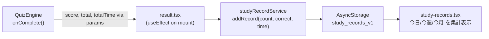
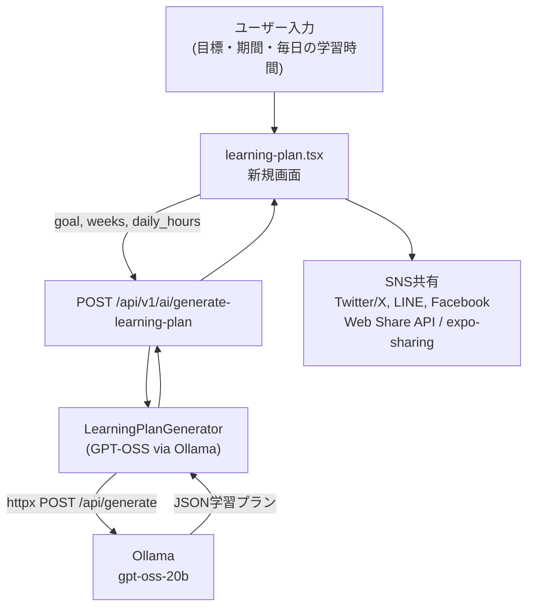

# AI学習プラン生成・SNS共有 + ローカル学習記録

## 概要

2つの機能を追加する。

1. **ローカル学習記録** — クイズ完了のたびに今日の解いた問題数・正解数・学習時間を AsyncStorage に記録し、今日/今週/今月の集計を閲覧できる専用画面を作る。
2. **AI学習プラン生成＋SNS共有** — GPT-OSS（Ollama経由）でパーソナライズ学習プランを生成し、Twitter/X・LINE・Facebook へシェアできる。

---

## 機能1: ローカル学習記録

### データ構造

AsyncStorage キー: `study_records_v1`

```typescript
interface StudyRecord {
  date: string;      // "YYYY-MM-DD"
  count: number;     // その日の合計解答数
  correct: number;   // その日の合計正解数
  studyTime: number; // 秒
}
// 保存形式: StudyRecord[] (配列、日付ごとに1エントリ)
```

### フロー




### 変更ファイル

- **新規: `[frontend/src/services/studyRecordService.ts](frontend/src/services/studyRecordService.ts)**`
  - `addRecord(count, correct, studyTimeSec)` — 今日の日付エントリを加算またはマージ
  - `getRecords()` — 全記録を返す
  - `getTodayStats()` / `getWeekStats()` / `getMonthStats()` — 集計ヘルパー
- `**[frontend/app/(app)/quiz/result.tsx](frontend/app/(app)`/quiz/result.tsx)**
  - `useEffect(() => { studyRecordService.addRecord(total, score, totalTime) }, [])` を追加
  - `total`, `score`, `totalTime` はすでに params から取得済みなので追加コードは最小限
- **新規: `[frontend/app/(app)/study-records.tsx](frontend/app/(app)`/study-records.tsx)**
  - 3枚のサマリーカード（今日 / 今週 / 今月）
  - 各カード: 問題数・正解数・正解率・学習時間
  - 過去30日の日別リスト（日付・問題数・正解率）
  - `useLanguage` で日英対応

---

## 機能2: AI学習プラン生成＋SNS共有

### アーキテクチャ




### 変更ファイル

- `**[backend/app/core/config.py](backend/app/core/config.py)**`
  - `OLLAMA_LEARNING_PLAN_MODEL: str = "gpt-oss-20b"` を追加
- **新規: `[backend/app/services/learning_plan_generator.py](backend/app/services/learning_plan_generator.py)**`
  - `copyright_checker.py` と同じ `httpx.AsyncClient` → `{OLLAMA_BASE_URL}/api/generate` パターン
  - 返却スキーマ: `{ "goal", "weeks": [{ "week", "theme", "days": [{ "day", "tasks": [...] }], "milestone" }] }`
  - JSON パース失敗時は graceful fallback
  - **プラン内容の粒度**: 「語彙強化」等の具体テーマを強制せず、モデルが自信を持てない場合は「復習/演習/模試/弱点復習」など**汎用タスク**で埋める（プロンプトで誘導）
- `**[backend/app/api/ai.py](backend/app/api/ai.py)**`
  - `POST /generate-learning-plan` を追加
  - リクエスト: `goal: str`, `weeks: int`, `daily_hours: float`, `weak_categories: list[str] = []`
- **新規: `[frontend/app/(app)/learning-plan.tsx](frontend/app/(app)`/learning-plan.tsx)**
  - 入力フォーム（目標テキスト・学習期間・毎日の時間）
  - AI生成ボタン + ローディングスピナー
  - 週ごとにアコーディオン展開で表示
  - SNS共有ボタン（Web: `navigator.share` / URLスキーム、Native: `expo-sharing`）
    - Twitter/X: `https://twitter.com/intent/tweet?text=...`
    - LINE: `https://social-plugins.line.me/lineit/share?text=...`
    - Facebook: `https://www.facebook.com/sharer/sharer.php?quote=...`

### 共有テキスト例

```
📚 AIが作った学習プラン（4週間）
目標: TOEIC 800点突破
今日解いた: 15問 / 今週: 70問 / 今月: 210問
---
第1週: 復習中心（目標: 模擬テスト65点）
第2週: 弱点演習...
#AI練習帳 #学習記録
```

---

## ダッシュボード変更

`**[frontend/app/(app)/dashboard.tsx](frontend/app/(app)`/dashboard.tsx)**

既存メニューに2ボタンを追加:

- 「学習記録」→ `/(app)/study-records` （グリーン系）
- 「AI学習プランを作る」→ `/(app)/learning-plan` （パープル系）

---

## 依存パッケージ

- `expo-sharing` — `expo install expo-sharing`（ネイティブ共有用）
- バックエンド: 追加なし（`httpx` は既存）

---

## 注意点

- Ollama が未起動の場合はエラーメッセージを表示してクラッシュしない
- 学習記録は **ログインしていなくても** ローカルに保存（キーにユーザーIDは含めない）
- 共有テキストは週数が多い場合は最初の2週 + 目標のみに省略してSNS文字数制限に対応
  - **学習記録の数値**（今日/今週/今月の解いた問題数）は `studyRecordService` の集計結果を `learning-plan.tsx` から参照して共有文を組み立てる

