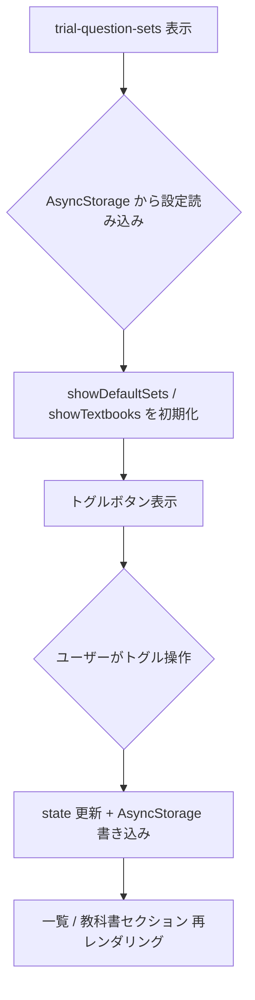

# trial画面タイトル修正と非表示機能

## 変更ファイル一覧

- `[frontend/app/(trial)/create.tsx](frontend/app/(trial)`/create.tsx)
- `[frontend/app/(app)/question-sets/create.tsx](frontend/app/(app)`/question-sets/create.tsx)
- `[frontend/app/(trial)/trial-question-sets.tsx](frontend/app/(trial)`/trial-question-sets.tsx)

---

## 1. (trial)/create.tsx — 「お試し」表記の削除

### 修正箇所

**105行目** — 画面内タイトルから `(Trial)` / `(お試し)` を削除:

```
// 変更前
{t("Create Question Set (Trial)", "問題セットを作成 (お試し)")}

// 変更後
{t("Create Question Set", "問題セットを作成")}
```

**110〜113行目** — trialNotice の文言から「お試しモード:」を削除:

```
// 変更前
"Trial mode: Data is stored locally on your device"
"お試しモード: データは端末にローカル保存されます"

// 変更後
"Data is stored locally on your device"
"データはこのデバイスにローカル保存されます"
```

---

## 2. (app)/question-sets/create.tsx — 未認証対応

現在の `if (!user)` でエラー Alert を表示して処理を止めているブロックを修正し、認証状態で保存先を分岐する。

```typescript
// 変更前（26〜32行目）
if (!user) {
  Alert.alert(t("Error", "エラー"), t("User not authenticated", "ユーザー認証されていません"));
  return;
}
// → API 保存 → /(app)/question-sets/{id}?mode=setup

// 変更後
if (!user) {
  // 未認証: ローカル保存
  const localSet = await localStorageService.saveTrialQuestionSet({
    title: t("New Question Set", "新しい問題集"),
    description: "",
    questions: [],
  });
  router.push(`/(trial)/set/${localSet.id}`);
  return;
}
// → API 保存 → /(app)/question-sets/{id}?mode=setup（変更なし）
```

`localStorageService` と `localStorageService.saveTrialQuestionSet` の戻り値（`LocalQuestionSet` の `id`）を使う。インポートに `localStorageService` を追加する。

---

## 3. trial-question-sets.tsx — 「問題を作る」ボタンのルート変更

```typescript
// 変更前
onPress={() => router.push("/(trial)/create")}

// 変更後
onPress={() => router.push("/(app)/question-sets/create")}
```

---

## 4. trial-question-sets.tsx — 非表示トグル追加

### 追加する state

```typescript
const [showDefaultSets, setShowDefaultSets] = useState(true);
const [showTextbooks, setShowTextbooks] = useState(true);
```

設定はアプリ再起動後も保持するため `AsyncStorage` に保存する。キーは `"pref_showDefaultSets"` / `"pref_showTextbooks"`。コンポーネント初回マウント時に読み込み、切り替え時に書き込む。

### UI — トグルボタン

ScrollView 内の先頭（ジャンプボタンの直下）に横並びのフィルターチップを追加:

```
[ デフォルト問題を表示/非表示 ]  [ 教科書を表示/非表示 ]
```

- アクティブ時: 塗りつぶしボタン（青 `#007AFF`）
- 非アクティブ時: アウトラインボタン（グレー）

### 問題セット一覧のフィルタリング

`questionSets.map(...)` の前に:

```typescript
const visibleSets = showDefaultSets
  ? questionSets
  : questionSets.filter((item) => !item.id.startsWith("default_"));
```

`visibleSets` でレンダリングする（`questionSets.length === 0` の空状態チェックは元の `questionSets` で行う）。

### 教科書セクションの条件付き表示

既存の `{availableTextbooks.length > 0 && ( ... 教科書セクション ... )}` を:

```tsx
{availableTextbooks.length > 0 && showTextbooks && ( ... 教科書セクション ... )}
```

に変更。教科書ジャンプボタンも `showTextbooks` が `false` のときは非表示にする。

---

## 動作フロー




