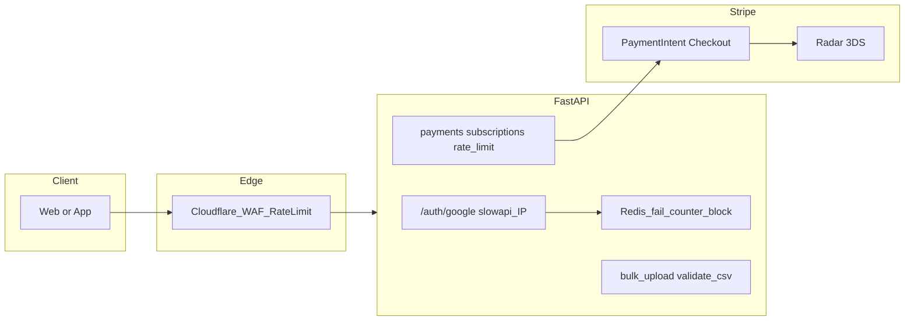

# セキュリティ対策の全面見直し（現状整理と実装方針）

## 現状サマリー（コードベース）

| 領域         | 現状                                                                                                                                                                               |
| ---------- | -------------------------------------------------------------------------------------------------------------------------------------------------------------------------------- |
| ログイン       | [Google OAuth のみ](backend/app/api/auth.py)（トークン検証・`aud` 検証あり）。パスワードログイン用エンドポイントは本リポジトリの `auth` にはない。                                                                             |
| アカウントロック   | `[users.failed_login_attempts` / `locked_until](backend/app/models/user.py)` は定義済みだが **参照・更新するコードがない**（[マイグレーション](backend/migrations/add_security_fields.sql) のみ）。               |
| レート制限      | `[slowapi](backend/app/main.py)` 利用。[`limiter`](backend/app/core/limiter.py) は `get_remote_address`（接続元 IP）。`[/auth/google` に `10/minute](backend/app/api/auth.py)` のみ確認。**決済系 API には `@limiter.limit` 未適用**（grep 結果）。                                   |
| アップロード     | [問題 CSV 一括登録](backend/app/api/questions.py) は `UploadFile` を UTF-8 デコードするのみ。**拡張子・MIME・サイズ上限の明示チェックなし**。                                                                         |
| SQL        | ORM（SQLAlchemy）中心。`**sqlalchemy.text` による動的 SQL は未使用**（アプリコード）。                                                                                                                  |
| XSS / ヘッダー | React のデフォルトエスケープ。[main.py で CSP 等](backend/app/main.py)（L51–71）。`dangerouslySetInnerHTML` は [gtag 等の固定スクリプト](frontend/app/_layout.tsx) のみ。 |
| 決済         | [Stripe Connect / Checkout](backend/app/api/payments.py), [subscriptions](backend/app/api/subscriptions.py)。PAN は自前で保持しない（PCI スコープ縮小）。                                           |
| 不正ログイン     | JWT・リフレッシュ検証は [core/auth](backend/app/core/auth.py)。Google 経路は上記レート制限に依存。                                                                                                        |

---

## 1. 「7回のログイン失敗でアカウントロック」と Google OAuth

**結論:** **Google のログイン画面でのパスワード失敗回数は Google が管理**しており、自アプリ側で「7回でロック」をそのまま再現することはできない。自アプリでできるのは次の区分に分ける。

1. **自前パスワード認証を将来追加する場合**
  - そのエンドポイントで `failed_login_attempts` / `locked_until` を **実際に更新**し、閾値を **7回**（要件どおり）、ロック時間を設定する。  
  - ユーザー存在の有無で文言が変わらないよう、既存ドキュメント方針どおり **同一の汎用エラー**を返す。
2. **Google OAuth のみの場合（現状）**
  - 「失敗」は主に **無効なトークン・なりすまし試行**であり、**アカウント単位の「7回ロック」**は意味が異なる。  
  - 実務的には **IP / クライアント単位のレート制限**、**短期ブロック**、**監査ログ**が相当策。  
  - 詳細は次節 **「1.1 OAuth 向け: IP 厳格化と連続失敗の一時拒否」**。

**Google が提供する「アカウントロック」:** 利用者の Google アカウント側のポリシーであり、**第三者アプリが API で「このユーザーをロック」する仕組みではない**。

---

## 1.1 OAuth 向け: IP ベースの厳しめ制限と連続失敗時の一時拒否（Redis）

**目的:** なりすまし・トークン総当たりに近い負荷を、**エッジ＋アプリ**の二層で抑える。要件の「7回」を **「同一 IP からの連続トークン検証失敗」**にマッピングする（アカウントロックではなく **一時的な拒否**）。

### フェーズ A — slowapi のみ（Redis なし）

- **二重デコレータ:** 同じ `google_login` に **グローバル緩め**（現状の `10/minute`）に加え、**同一 IP 向け厳しめ**（例: `30/hour` や `5/minute`）を `@limiter.limit` で重ねるか、エンドポイント専用の Limiter インスタンスで key を IP に固定する。
- **クライアント IP の取り方:** Render / Cloudflare 等の **信頼できるリバースプロキシ**の背後では、`get_remote_address` が **プロキシの IP** にならないよう、`X-Forwarded-For` の **先頭（クライアント）**を使うカスタム `key_func` を検討（**信頼境界外では偽装可能**なため、プロキシで不正ヘッダを剥がす前提）。
- **限界:** slowapi のデフォルトストレージはメモリのため、**複数ワーカー／複数インスタンス**ではカウントが共有されず、制限が抜けやすい。

### フェーズ B — Redis で「連続失敗 → 一時拒否」

**トリガー:** `_google_login_impl` が **トークン無効・aud 不一致・Google API エラー**などで失敗したときのみカウンタを増やす（成功時はリセットまたはスキップ）。

**キー設計（例）:**

- `oauth:fail:ip:{client_ip}` — `INCR` + `EXPIRE`（スライディングまたは固定ウィンドウ）
- 閾値例: **7 回 / 15 分** で **15 分間 `429` または `403`**（メッセージは汎用）

**ブロックチェック:** ハンドラ先頭で Redis `GET oauth:block:ip:{ip}` または失敗カウンタが閾値以上なら即拒否（DB 負荷をかけない）。

**運用:**

- 環境変数 `REDIS_URL` 未設定時はフェーズ B を **無効**（フェーズ A のみ）。
- 依存追加: `redis`（非同期クライアント推奨: `redis.asyncio`）。

**注意（誤検知）:**

- **同一 NAT / 企業出口 / モバイルキャリア**では多数ユーザーが同一 IP に見える → 閾値・ウィンドウは **ログを見て調整**。
- 正当ユーザーより **ボット攻撃**を優先して止めたい場合は、エッジ（Cloudflare Bot Fight / WAF）と併用が有効。

### ログ・監査

- 失敗時: **IP・時刻・失敗理由コード**（クライアントには出さない）を構造化ログに残す。
- ブロック発火時: 同上＋ `action=temp_block`。

---

## 2. Web サーバー／アプリによるアップロード制限

**ギャップ:** [bulk-upload](backend/app/api/questions.py) に **拡張子（`.csv`）・Content-Type・ファイルサイズ上限**の検証がない。

**方針（実装候補）:**

- アップロード直後に `filename` のサフィックス、許可 MIME（`text/csv`, `application/csv`, `text/plain` 等）をホワイトリスト化。
- `settings` に **最大バイト数**（例: 数 MB）を環境変数化し超過時は 413。
- リバースプロキシ（Cloudflare / Render 前段）があれば **クライアントボディサイズ**も併せて制限（インフラ設定）。

---

## 3. 脆弱性診断・ペネトレーションテスト

**性質:** 主に **プロセス・契約**（年1回・リリース前など）で、成果物は「指摘・是正チケット」。

**コードリポジトリでできること:**

- `docs/` または社内手順に **実施頻度・範囲・担当**を明記。  
- CI で **依存関係の脆弱性スキャン**（`pip audit` / GitHub Dependabot、`npm audit`）を **定期または PR 時**に回すのは現実的な補完策。

---

## 4. SQL インジェクション・XSS

- **SQL:** 現状は ORM パラメータバインドが主。**今後 `text()` や生文字列連結を入れない**ことを開発ルール化。  
- **XSS:** ユーザー生成 HTML を `dangerouslySetInnerHTML` で描画しない。Markdown 等を導入する場合は **サニタイズライブラリ**必須。  
- **CSP:** 現状 `unsafe-inline` あり（[main.py](backend/app/main.py)）。厳格化は **nonce/hash 化**が別タスクになり得る。

---

## 5. セキュアコーディング・ソースコードレビュー・入力検証

- **Pydantic** による API 入力制約は既存パターンを継続。  
- **チェックリスト化**（PR テンプレートや `CONTRIBUTING`）で「認可・入力・エラー情報の露出」をレビュー項目に含める。  
- 決済・管理者 API は **権限デコレータ**の見落としがないかをレビュー重点に。

---

## 6. マルウェア検知・ウイルス対策

- **アプリコードで ClamAV を組み込む**のはコストが高い。  
- **現実解:** ホスティング（Render 等）のセキュリティ説明、**開発者マシン・CI ランナーの OS 標準／企業ポリシー**、**アップロード先をクラウドストレージにしマルスキャン付き**などを組み合わせる。  
- 要件が「サーバに AV を入れる」なら **OS レイヤ（マネージドの責務分界）**を確認する。

---

## 7. クレジットカード・有効性確認まわりのチェックリスト

自サービスは **Stripe がカードデータを扱う**ため、**カード番号の「有効性当たり」を自前 API で繰り返す**パターンは基本ない。それでもチェックリストに沿うなら次を **コード＋ Stripe ダッシュボード**で整理する。

| チェックリスト項目       | 対応の持ち場                                                                                                       |
| --------------- | ------------------------------------------------------------------------------------------------------------ |
| 不審 IP からのアクセス制限 | **Cloudflare WAF / IP アクセスルール**、または API ゲートウェイ。アプリ内は **レート制限・ブロックリスト**で補助。                                   |
| 同一アカウントからの入力制限  | `**create-payment-intent` / `create-checkout` にユーザー単位レート制限**（例: 時間あたり回数）。                                    |
| エラー時に内容を伏せる     | Stripe 失敗時は **クライアントへは汎用メッセージ**、詳細は **サーバログのみ**（[payments.py](backend/app/api/payments.py) の例外ハンドリングを点検）。    |
| EMV 3-D セキュア    | **Stripe PaymentIntent / Checkout** で SCA・3DS が働く設定。**ダッシュボード**と `payment_method_options`（要否はカード・規制による）を文書化。 |
| SMS 通知          | **カード会社・3DS フロー側**が中心。自前 SMS はコスト・仕様が大きい。**「3DS でissuer が認証」**として説明可能かを整理。                                   |
| 有効性確認の回数制限      | **意図した決済開始 API へのレート制限**＋ **Radar / 不正検知ルール**（Stripe 側）。                                                     |

---

## 8. 不正ログイン対策（総合）

- **既存:** JWT 期限・リフレッシュ検証、Google トークン検証、CORS、セキュリティヘッダー、`/auth/google` レート制限。  
- **追加（本プランで具体化）:** **1.1** の IP 厳格化（slowapi）＋ **Redis による連続失敗一時拒否**（マルチインスタンスでも有効）。  
- **その他:** 決済・管理 API への **slowapi**、**失敗イベントの監査ログ**、必要なら **2FA**（既に `[two_factor_router](backend/app/main.py)` が存在するため **運用・カバー範囲の確認**）。

---

## 推奨アーキテクチャ（概念）

---

## 実装優先度の目安

**高（コードで効果が大きい）**

1. アップロード: **拡張子・MIME・サイズ**の検証（[questions.py bulk-upload](backend/app/api/questions.py)）。
2. 決済: `**create-payment-intent` / `create-checkout` / `confirm-purchase` にレート制限**と **エラーレスポンスの一般化**。
3. OAuth: **1.1 フェーズ A**（IP 厳格 slowapi、`X-Forwarded-For` は信頼プロキシ前提で key_func 検討）。
4. OAuth: **1.1 フェーズ B**（Redis 連続失敗ブロック、閾値 7 回など環境変数化）— インフラに Redis を足せるタイミングで。

**中（設計・ドキュメント・インフラ）**

1. Cloudflare（または同等）で **WAF・ボディサイズ・レート制限**。
2. Stripe ダッシュボード: **Radar・3DS・メールレシート**等の有効化を手順書化。
3. **脆弱性スキャンを CI に追加**、ペネトレは **年次計画**。

**低または別責務**

1. サーバ AV・フルスキャン: **インフラポリシー**で記載。
2. CSP の `unsafe-inline` 削減: フロントビルド方式に依存する **別イテレーション**。
3. パスワード認証を入れる場合のみ: **7 回ロック**を DB フィールドで実装（lockout-strategy TODO）。

---

## 重要な認識合わせ

- **「全面的に見直し」のうち、半分はアプリコードではなく「運用・インフラ・Stripe・Cloudflare」の設定と証跡**（ログ、レポート、是正記録）になる。  
- **Google OAuth のみ**のままでは、ドキュメントにある **「5回/7回でアカウントロック」**は **未実装かつパスワード認証なしでは成立しない** — **OAuth 経路では「同一 IP の連続トークン失敗による一時拒否」（1.1）で要件に近い制御をかける**のが現実的。
- **slowapi 単体はマルチプロセスで弱い**ため、本番スケールでは **Redis フェーズ B** を推奨。
