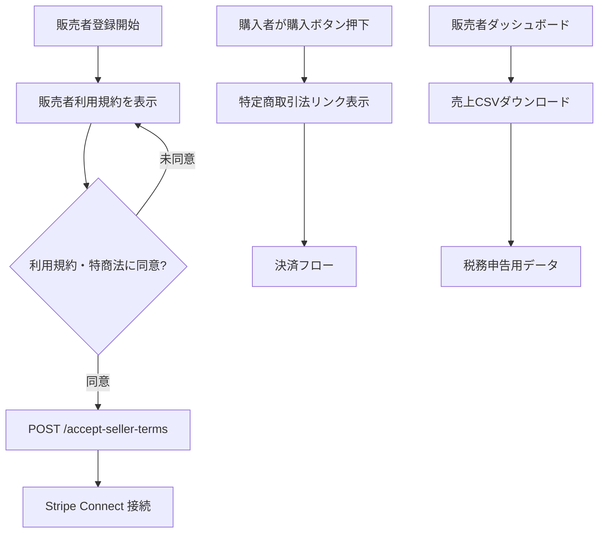

# マーケットプレイス法令対応実装プラン

## 現状

- 決済周りは `backend/app/api/payments.py`（現在はモック）、`Purchase`モデルは `backend/app/models/marketplace.py` に存在
- 手数料10%・販売者90%の分配ロジックは実装済み
- 販売者ダッシュボード `frontend/app/(app)/seller-dashboard.tsx` はあるが法令対応なし
- 法的ページ（特定商取引法・利用規約）は未存在

## 変更ファイル一覧

### Backend

1. `**[backend/app/models/user.py](backend/app/models/user.py)**`
  - `seller_terms_accepted_at = Column(DateTime, nullable=True)` を追加
2. `**[backend/app/api/payments.py](backend/app/api/payments.py)**`
  - `POST /accept-seller-terms` エンドポイント追加（同意日時を記録）
  - `GET /seller-revenue-export` エンドポイント追加（税務用CSVデータを返す）

### Frontend（新規ページ）

1. `**frontend/app/(app)/legal/tokusho.tsx**`（特定商取引法に基づく表記）
  - 事業者名、住所、連絡先、支払方法、引渡時期、返金ポリシーを表示
2. `**frontend/app/(app)/legal/seller-terms.tsx**`（販売者向け利用規約）
  - 売上分配率（販売者90% / プラットフォーム10%）
  - 返金条件（デジタルコンテンツのため原則不可、重大な欠陥を除く）
  - 不正販売時の対応（即時停止・売上没収）
  - 税務義務（年間20万円超は確定申告必要）
3. `**frontend/app/(app)/legal/tax-notice.tsx**`（税務のご案内）
  - 副業所得扱いになる条件の案内
  - 売上記録ダウンロード方法の説明

### Frontend（既存ページ修正）

1. `**[frontend/app/(app)/seller-dashboard.tsx](frontend/app/(app)`/seller-dashboard.tsx)**
  - Stripe Connect 接続前に販売者利用規約・特定商取引法への同意チェックボックスを追加
  - 未同意の場合はボタンをdisableに
  - 売上CSVダウンロードボタン追加（税務申告用）
2. `**frontend/app/(app)/question-sets/[id].tsx**`（購入フロー）
  - 購入ボタン付近に特定商取引法ページへのリンクを追加

## フロー図

## 特定商取引法 必須表示項目

- 事業者名：アプリ名/運営会社名（要設定）
- 所在地：運営者住所（要設定）
- 電話番号/メール：問い合わせ先
- 商品価格：各問題集ページに¥表示済み
- 支払方法：クレジットカード（Stripe）
- 引渡時期：購入後即時
- 返品・キャンセル：デジタルコンテンツのため購入後の返品不可（重大な欠陥を除く）

## 注意事項

- 特定商取引法ページの「事業者名・住所・電話番号」は運営者が実際の情報を埋める必要あり（プレースホルダーで実装）
- 税務対応は「ユーザーへの案内」が主目的。税理士への相談を促す文言を含める
- DBマイグレーションが必要（`seller_terms_accepted_at`列追加）

