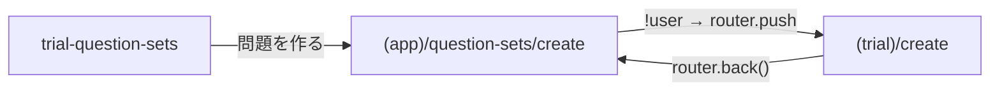
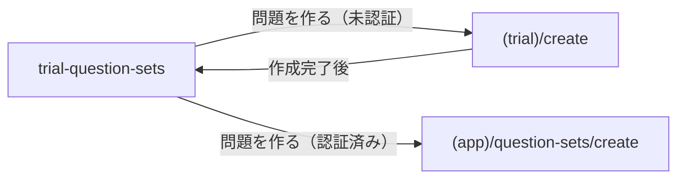

# 作成フロー遷移修正

## 全遷移フロー確認結果

11ファイルの全 `router.push` / `replace` / `back` / `Redirect` を調査済み。

問題なし: index.tsx, (trial)/set/[id].tsx, question/[questionIndex].tsx, quiz/[id].tsx, textbook系2件, (app)/flashcard/[id].tsx (isTrial判定あり、未認証OK), (auth)/register.tsx, (auth)/login.tsx

問題あり: 以下の3ファイルの作成フロー遷移のみ。

## 問題点

現在のフロー（未認証時）:




`router.back()` で `(app)/question-sets/create` に戻ってしまう。さらにそこでボタンを押すと再度 `(trial)/create` に飛ばされてループする。

## 修正方針

中間ページを経由せず、未認証時は直接 `(trial)/create` へ遷移する。

修正後のフロー:




## 変更ファイル（2ファイル）

### 1. `[frontend/app/(trial)/trial-question-sets.tsx](frontend/app/(trial)`/trial-question-sets.tsx)

ボタンの遷移先で認証状態を判定し、未認証なら直接 `/(trial)/create` に飛ばす:

```typescript
// 変更前（現在）
onPress={() => router.push("/(app)/question-sets/create")}

// 変更後
onPress={() =>
  user
    ? router.push("/(app)/question-sets/create")
    : router.push("/(trial)/create")
}
```

`useAuth` のインポートと `user` の取得を追加する。

### 2. `[frontend/app/(trial)/create.tsx](frontend/app/(trial)`/create.tsx) (199行目)

作成完了後の `router.back()` を `router.replace()` に変更して、一覧に確実に戻す:

```typescript
// 変更前
setTimeout(() => router.back(), 1500);

// 変更後
setTimeout(() => router.replace("/(trial)/trial-question-sets"), 1500);
```

### 3. `[frontend/app/(app)/question-sets/create.tsx](frontend/app/(app)`/question-sets/create.tsx) (48-51行目)

中間リダイレクトのコードを削除（もう `trial-question-sets.tsx` 側で分岐するため不要）。万一直アクセスされた場合のフォールバックとして残すなら `router.replace` に変更:

```typescript
// 変更前
router.push("/(trial)/create");

// 変更後
router.replace("/(trial)/create");
```

`replace` にすることで履歴スタックに残らず、`router.back()` でここに戻ってくる問題を防ぐ。