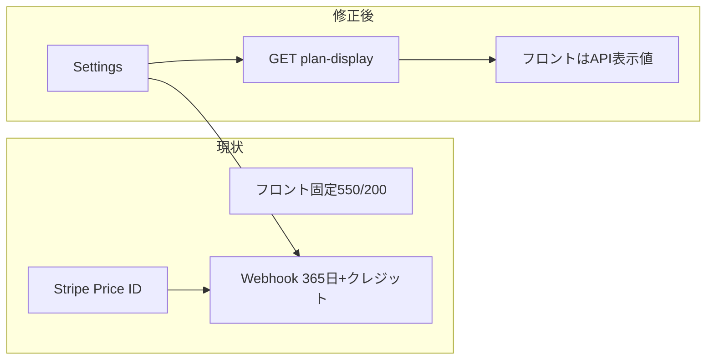

# 有料プラン表示・設定の整合修正

## 現状の問題（要約）

| 箇所                                                                               | 問題                                                                                                                                                         |
| -------------------------------------------------------------------------------- | ---------------------------------------------------------------------------------------------------------------------------------------------------------- |
| [frontend/app/(app)/premium-upgrade.tsx](frontend/app/(app)/premium-upgrade.tsx) | ラベルが「**月額**」だが、バックエンドは Stripe Checkout `**mode="payment"`（一回払い）** + [subscriptions.py](backend/app/api/subscriptions.py) の `**PREMIUM_PLAN_DAYS = 365**`   |
| 同上                                                                               | `PLAN_PRICE_JPY = 550` / `PLAN_CREDIT_JPY = 200` が **フロント固定** で、[config.py](backend/app/core/config.py) の `PREMIUM_PLAN_CREDIT_JPY` や Stripe 側 Price と二重管理 |
| [frontend/app/index.tsx](frontend/app/index.tsx)                                 | ログインモーダル内でクラウド保存が **「準備中」** だが、プレミアムでは [quiz/[id].tsx](frontend/app/(app)/quiz/[id].tsx) のクラウド保存・[answers の migrate](backend/app/api/answers.py) が既に実装済み   |

## 方針（スコープ内）

- **課金モデルは据え置き**：一回払い Checkout + Webhook で 1 年有効 + クレジット付与（Stripe Subscriptions への切り替えは今回含めない）。
- **表示の真実の源泉**：金額・付与クレジット・有効日数を [backend/app/core/config.py](backend/app/core/config.py) に集約し、**読み取り専用 API** でフロントへ渡す（Stripe の実際の請求額は引き続き Price ID が正）。表示用 `PREMIUM_PLAN_PRICE_JPY` を追加し、運用で Stripe ダッシュボードの価格と一致させる。

## バックエンド

1. **設定の拡張**（[config.py](backend/app/core/config.py)）
  - `PREMIUM_PLAN_PRICE_JPY: int = 550`（表示・ドキュメント用途。コメントで Stripe Price と揃えることと明記）
  - `PREMIUM_PLAN_VALIDITY_DAYS: int = 365`
2. **[subscriptions.py](backend/app/api/subscriptions.py)**
  - モジュール定数 `PREMIUM_PLAN_DAYS` を廃止し、`settings.PREMIUM_PLAN_VALIDITY_DAYS` を参照
  - 新規 `**GET /subscriptions/plan-display**`（認証不要で可）：レスポンス例  
  `{ "price_jpy", "credit_jpy", "validity_days" }`  
  値はすべて `settings` から
  - 既存コメントの「200円」など固定文言を設定値に合わせた表現に更新
3. **ルーター登録**
  既に [main.py](backend/app/main.py) で `subscriptions` が載っているため、同一ルーターにエンドポイント追加のみ

## フロントエンド

1. **[subscriptions.ts](frontend/src/api/subscriptions.ts)**
  - `getPlanDisplay(): Promise<PlanDisplay>` を追加（`apiClient.get('/subscriptions/plan-display')`）
  - JSDoc の「550円固定」表現をやめ、API 由来である旨に変更
2. **[premium-upgrade.tsx](frontend/app/(app)/premium-upgrade.tsx)**
  - マウント時に `getPlanDisplay()` を取得（ローディング表示；失敗時は既存数値にフォールバックするか、アラート＋再試行は好みだが **フォールバック** でオフライン開発を壊さないのが無難）
  - **「月額」削除**：例）「1回のお支払い（税込）」「プレミアム有効：購入から〇日」※ `validity_days` を表示に使う
  - 特典文・ボタン文言の金額・クレジットは **state の表示値** に統一
3. **[index.tsx](frontend/app/index.tsx)**（ログインモーダル内のクラウド枠）
  - 「coming soon / 準備中」を削除し、**プレミアム向けにクラウド同期が利用可能**である旨に差し替え（トップの別モーダル [trial 警告側](frontend/app/index.tsx) と矛盾しないように、無料＝ローカル / ログイン＋プレミアム＝クラウド の整理を一文で明示）

## スコープ外（今回やらない）

- Stripe **サブスクリプション**への移行、Price の自動照合 API
- README / docs の追記（必要なら別タスク）

## 検証

- バックエンド：`GET /api/v1/subscriptions/plan-display` が 200 で期待 JSON
- フロント：プレミアム画面で「月額」が消え、年間/一回払いに読めること；index モーダルに「準備中」が残っていないこと

