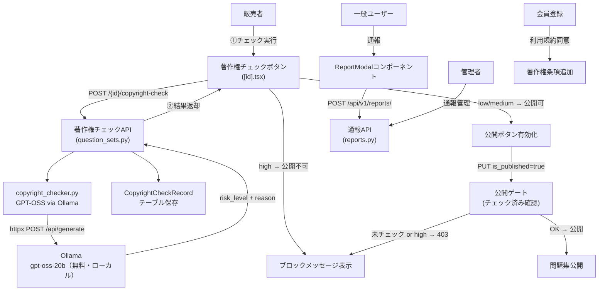

# 著作権保護対策 実装プラン

## 全体構成



---

## AI著作権チェック（GPT-OSS・無料）

### 使用技術

- **モデル**: GPT-OSS-20B（OpenAI製オープンウェイト・Apache 2.0・商用無料）
  - 16GB VRAM 以内で動作。GPU なしでも CPU で実行可（低速）
  - GPT-OSS-120B は 80GB GPU 必要なため通常は 20B を推奨
- **実行基盤**: Ollama（既にプロジェクトで `OLLAMA_BASE_URL` として設定済み）
- **統合パターン**: [`backend/app/services/local_translator.py`](backend/app/services/local_translator.py) と同じ `httpx` 呼び出し

### 販売者向けチェックフロー

1. 販売者が問題集編集画面で「著作権チェックを実行」ボタンを押す
2. `POST /api/v1/question-sets/{id}/copyright-check` を呼び出す
3. バックエンドが GPT-OSS（Ollama経由）に問題集内容を渡して評価させる
4. 結果を `copyright_check_records` テーブルに保存
5. 公開時（`PUT /{id}` で `is_published=true`）は最新チェック結果が `low` or `medium` でなければ 403 を返す

### 新規ファイル: `backend/app/models/copyright_check.py`

```python
class RiskLevel(str, enum.Enum):
    LOW = "low"
    MEDIUM = "medium"
    HIGH = "high"

class CopyrightCheckRecord(Base):
    __tablename__ = "copyright_check_records"
    id = Column(String, primary_key=True)
    question_set_id = Column(String, ForeignKey("question_sets.id"), index=True)
    risk_level = Column(Enum(RiskLevel, ...))
    reasons = Column(Text)        # JSON list
    recommendation = Column(Text)
    raw_response = Column(Text)   # GPT-OSS の生レスポンス（デバッグ用）
    checked_at = Column(DateTime, default=datetime.utcnow)
    question_set = relationship("QuestionSet")
```

### 新規ファイル: `backend/app/services/copyright_checker.py`

`local_translator.py` と同パターンで実装:

```python
class CopyrightChecker:
    def __init__(self, base_url: str = "http://localhost:11434"):
        self.base_url = base_url
        self.model = settings.OLLAMA_COPYRIGHT_CHECK_MODEL  # "gpt-oss-20b"

    async def check(self, title, description, question_texts) -> dict:
        # httpx で POST {base_url}/api/generate
        # GPT-OSS にプロンプトを送信
        # JSON レスポンスをパースして risk_level / reasons / recommendation を返す
        ...
```

プロンプト設計（推論精度のため英語で送信）:

```
You are a copyright compliance auditor for an educational quiz platform.
Analyze the following content and determine if it shows signs of being copied
from copyrighted materials (textbooks, standardized tests, paid courses, etc.).

Respond ONLY in JSON:
{"risk_level": "low"|"medium"|"high", "reasons": [...], "recommendation": "..."}

HIGH risk indicators: copyright notices, publisher/author names, standardized test
formatting (e.g. "Which of the following BEST describes..."), specific book references,
verbatim passages from known publications.
LOW risk indicators: original phrasing, general knowledge questions, creative content.
```

### `question_sets.py` への変更

**新エンドポイント**:

```
POST /api/v1/question-sets/{id}/copyright-check
```
- 要認証（作成者のみ）
- Ollama が起動していない場合は 503 を返す

**既存 PUT エンドポイントにガード追加**:

```python
if update_data.is_published and not db_question_set.is_published:
    latest = db.query(CopyrightCheckRecord)\
        .filter_by(question_set_id=question_set_id)\
        .order_by(CopyrightCheckRecord.checked_at.desc()).first()
    if not latest or latest.risk_level == RiskLevel.HIGH:
        raise HTTPException(403,
            "著作権チェックを実行し、問題がないことを確認してから公開してください")
```

### `backend/app/core/config.py` への変更

```python
OLLAMA_COPYRIGHT_CHECK_MODEL: str = "gpt-oss-20b"
```

---

## バックエンド変更（通報フロー）

### `ContentReport` モデル新規作成

**ファイル**: `backend/app/models/report.py`（新規）

- `ReportReason` Enum: `copyright` / `spam` / `inappropriate` / `other`
- `ReportStatus` Enum: `pending` / `reviewing` / `resolved` / `rejected`
- `ContentReport` テーブル `content_reports`:
  - `id`, `reporter_id` (FK→users), `question_set_id` (FK→question_sets)
  - `reason` (Enum), `description` (Text, nullable)
  - `status` (デフォルト `pending`)
  - `admin_note` (nullable), `created_at`, `updated_at`

### 通報APIルーター新規作成

**ファイル**: `backend/app/api/reports.py`（新規）

- `POST /api/v1/reports/` — 通報作成（要認証・重複は400）
- `GET /api/v1/reports/` — 通報一覧（管理者のみ・status/reason でフィルタ可）
- `PUT /api/v1/reports/{report_id}` — ステータス更新・管理者メモ（管理者のみ）

### 既存ファイルの更新

- [`backend/app/models/__init__.py`](backend/app/models/__init__.py) — `CopyrightCheckRecord` + `ContentReport` を追加
- [`backend/app/api/__init__.py`](backend/app/api/__init__.py) — `reports_router` を追加
- [`backend/app/main.py`](backend/app/main.py) — `reports_router` をマウント（`/api/v1/reports`）

---

## フロントエンド変更

### 問題集詳細画面に著作権チェックUI を追加

**ファイル**: [`frontend/app/(app)/question-sets/[id].tsx`](frontend/app/(app)/question-sets/[id].tsx)（販売者ビューのみ）

- 「著作権チェックを実行」ボタン（`is_seller` ユーザーのみ表示）
- チェック中はローディングスピナー表示（Ollama は数秒〜十数秒かかる）
- 結果表示:
  - `low` / `medium` → 緑「問題なし・公開可能」＋理由テキスト
  - `high` → 赤「公開不可」＋理由テキスト＋修正の推奨
- 公開トグルは最新チェックが `low/medium` の時のみ有効化

### 通報APIクライアント新規作成

**ファイル**: `frontend/src/api/reports.ts`（新規）

- `createReport(questionSetId, reason, description)` — POST
- `getReports(params?)` — GET（管理者用）
- `updateReport(reportId, status, adminNote?)` — PUT

### `ReportModal` コンポーネント新規作成

**ファイル**: `frontend/src/components/ReportModal.tsx`（新規）

- 通報理由を選択（著作権侵害 / スパム / 不適切 / その他）
- 任意の説明テキスト入力欄
- 「送信」で `reportsApi.createReport()` 呼び出し、完了 Alert 表示
- 自分の問題集には「通報」ボタン非表示

### 利用規約に著作権条項を追加

**ファイル**: [`frontend/app/(auth)/register.tsx`](frontend/app/(auth)/register.tsx)

既存の `showTermsModal` モーダル内に以下を追記：
- 投稿コンテンツの著作権は投稿者に帰属
- 第三者の著作権を侵害するコンテンツ（市販問題集の丸パクリ・過去問全文転載等）の投稿禁止
- 違反コンテンツは通告なく削除・アカウント停止する場合がある

### 問題集作成時に著作権同意チェックを追加

**ファイル**: [`frontend/app/(app)/question-sets/create.tsx`](frontend/app/(app)/question-sets/create.tsx)

- `agreedToCopyright` state を追加
- 作成ボタン押下時に未同意なら Alert で確認

---

## 前提条件（セットアップ）

販売者のサーバー or 開発環境で Ollama を起動し、GPT-OSS モデルを pull しておく必要がある:

```bash
ollama pull gpt-oss-20b
ollama serve
```

Ollama が起動していない場合はチェック API が 503 を返す。

## 実装しないもの（スコープ外）

- 管理者向けの通報管理UI画面（`admin.py` API経由で対応、UI は別タスク）
- メール通知（通報受付確認・対応完了通知）
