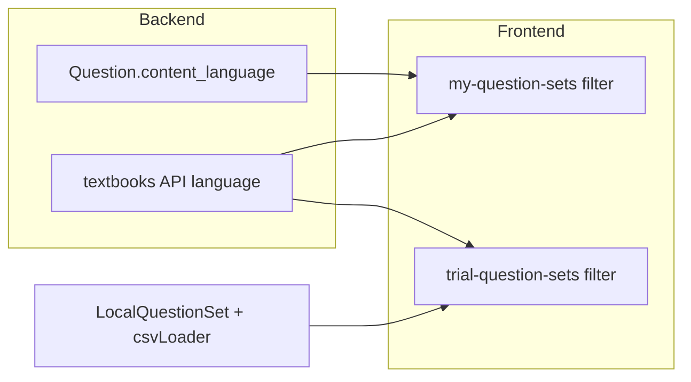

# 日本語・英語で絞り込む機能（問題集・購入済み・教科書）

## 現状

- `[backend/app/models/question.py](backend/app/models/question.py)` の `QuestionSet` / `Question` には言語カラムがない。
- 問題集 API の一覧は `[backend/app/api/question_sets.py](backend/app/api/question_sets.py)` で `category` / `is_published` のみフィルタ可能。
- ログイン後の問題まわりの UI は主に `[frontend/app/(app)/my-question-sets/index.tsx](frontend/app/(app)`/my-question-sets/index.tsx)（マイ問題集・**購入済み**・教科書）。お試しは `[frontend/app/(trial)/trial-question-sets.tsx](frontend/app/(trial)`/trial-question-sets.tsx)（ローカル問題セット＋教科書）。
- 教科書は `[backend/app/api/textbooks.py](backend/app/api/textbooks.py)` が `docs/textbook` をスキャンし、`path` / `name` / `type` のみ返す。

「UI だけで推測フィルタ」は誤判定が多いため、**バックエンド・ローカルデータに明示的な `content_language`（または `language`）を保存**し、フィルタはその値で行う方針とする。値は `**ja` | `en**` の2択（将来 `"both"` 等が必要なら拡張可能）。

## 1. バックエンド：問題集に言語を保存

- **モデル**: `QuestionSet` に `content_language` 列を追加（`String`, 非 null, **デフォルト `ja**`）。既存行はマイグレーションで `ja` になる。
- **スキーマ**: `[QuestionSetCreate](backend/app/api/question_sets.py)` / `QuestionSetUpdate` / `QuestionSetResponse` に `content_language: Optional`（更新・応答）または必須（作成時デフォルト `ja`）を追加。
- **作成処理**: `create_question_set` でリクエスト値または省略時 `ja` を保存。
- **一覧クエリ**: `list_question_sets` に `content_language: Optional[str] = Query(None)` を追加し、`ja` / `en` のとき一致で `filter`。
- **手組み立てレスポンス**: `list_question_sets` / `get_my_question_sets` / `get_purchased_question_sets` の `dict` に `content_language` を含める（`get_question_set` 等の ORM 直返しはカラム追加で自動対応）。

マイグレーションは既存の `[backend/run_migration.py](backend/run_migration.py)` または SQL スクリプトの流儀に合わせて **ALTER TABLE 1 本**追加。

## 2. フロント：API 型・作成・編集

- `[frontend/src/api/questionSets.ts](frontend/src/api/questionSets.ts)` の `QuestionSet` / `QuestionSetCreate` / `QuestionSetUpdate` に `content_language?: 'ja' | 'en'` を追加。`getAll` の `params` に `content_language` を足す（将来マーケット一覧向け）。
- `[frontend/app/(app)/question-sets/create.tsx](frontend/app/(app)`/question-sets/create.tsx) と `[frontend/app/(app)/question-sets/edit.tsx](frontend/app/(app)`/question-sets/edit.tsx) に **日本語 / 英語**の選択（セグメントまたは Picker）を追加し、保存時に送る。

## 3. お試しローカル問題集

- `[frontend/src/services/localStorageService.ts](frontend/src/services/localStorageService.ts)` の `LocalQuestionSet` に `content_language?: 'ja' | 'en'` を追加（未設定は `ja` とみなす互換）。
- `[frontend/src/services/csvLoaderService.ts](frontend/src/services/csvLoaderService.ts)` の各 CSV メタに言語を明示（例: `business english` / `Deep Learning Engineering Questions` / `ai practice` → `en`、`E資格 問題集` → `ja` 等。`**japanese wordbook` は内容に合わせて `ja` または `en` を仕様で固定**）。
- `initializeDefaultQuestions` の更新パスで、既存 `default_` セットにも `content_language` をマージ更新できるよう、既存ロジック（`title` マッチ更新）を継承。

## 4. フィルタ UI（問題・購入済み・教科書）

共通イメージ: 画面上部に **「すべて | 日本語 | 英語」** のトグル（既存のフィルタチップ行に近いスタイルで統一）。

| 画面                                                                            | 対象                                                                                                            |
| ----------------------------------------------------------------------------- | ------------------------------------------------------------------------------------------------------------- |
| `[my-question-sets/index.tsx](frontend/app/(app)`/my-question-sets/index.tsx) | `myQuestionSets` / `purchasedQuestionSets` を `content_language` で絞る。**購入済み**も同じ state でフィルタ（＝ユーザー要望の「問題購入」側）。 |
| `[trial-question-sets.tsx](frontend/app/(trial)`/trial-question-sets.tsx)     | ローカル `questionSets` を言語で絞る（デフォルト表示トグルとは併用可）。                                                                  |
| 両画面の教科書                                                                       | 下記 API の `language` で絞る。                                                                                      |

文言は既存どおり `[useLanguage().t](frontend/src/contexts/LanguageContext.tsx)` で英日対応。

## 5. 教科書 API・フロント

- `[TextbookInfo](backend/app/api/textbooks.py)` に `language: str`（`ja` / `en`）を追加。
- `list_textbooks` で各ファイルに対し **マッピング**（`path` または `name` による辞書）で決定。スキャンだけの新規ファイルはデフォルト `ja` または不明時 `ja` にし、コメントで「追加時はマッピング更新」を明記。
- `[frontend/src/api/textbooks.ts](frontend/src/api/textbooks.ts)` / `[textbookService.ts](frontend/src/services/textbookService.ts)` の型・`FALLBACK_TEXTBOOKS` に `language` を付与。

## 6. スコープ外（必要なら別タスク）

- **1 問ごとの言語**（問題文が日英混在するセット内の行フィルタ）: `Question` テーブルへの列追加と `[questionsApi.getAll](frontend/src/api/questions.ts)` のクエリ拡張が必要。今回は **問題集単位の言語**で要件を満たす前提とする。
- **未使用の `questionSetsApi.getAll**`: 市場一覧を実装する際に同じ `content_language` クエリを利用可能。

## データフロー（概要）

