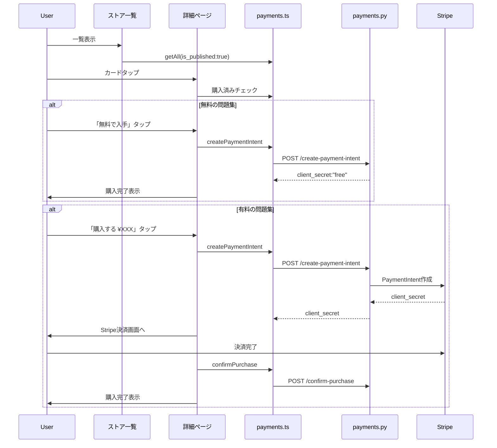

# 販売ページ（マーケットプレイス）構築

## 現状

- バックエンド: `create-payment-intent`, `confirm-purchase` 等の決済API実装済み（[backend/app/api/payments.py](backend/app/api/payments.py)）
- フロントAPI: `paymentsApi.createPaymentIntent`, `confirmPurchase` 定義済みだが未使用（[frontend/src/api/payments.ts](frontend/src/api/payments.ts)）
- 問題集一覧API: `questionSetsApi.getAll({ is_published: true })` 定義済みだが未使用（[frontend/src/api/questionSets.ts](frontend/src/api/questionSets.ts)）
- 詳細ページ: 価格表示あり、購入ボタンなし（[frontend/app/(app)/question-sets/[id].tsx](frontend/app/(app)/question-sets/[id].tsx)）

## 構築内容

### 1. ストア一覧ページの新規作成

`frontend/app/(app)/store.tsx` を新規作成。

- `questionSetsApi.getAll({ is_published: true })` で公開中の問題集を一覧取得
- カード形式で表示: タイトル、説明、カテゴリ、問題数、価格、購入数
- 無料 / 有料のバッジ表示
- カテゴリフィルタ（オプション）
- カードタップで既存の詳細ページ `/(app)/question-sets/[id]` に遷移
- 既存の [my-question-sets/index.tsx](frontend/app/(app)/my-question-sets/index.tsx) のカードUIスタイルを流用

### 2. 詳細ページに購入ボタン追加

[frontend/app/(app)/question-sets/[id].tsx](frontend/app/(app)/question-sets/[id].tsx) を修正。

- 他ユーザーの公開問題集で、かつ未購入の場合に「購入する」ボタンを表示
- 無料の場合: `createPaymentIntent` を呼び出し（バックエンドが即座に Purchase レコード作成 → `client_secret: "free"` を返す）、成功メッセージ表示
- 有料の場合: `createPaymentIntent` を呼び出し、Stripe Checkout URL にリダイレクト（Web）、またはアプリ内で Payment Sheet を利用
- 購入済みの場合: 「購入済み」バッジを表示し、クイズ開始等のボタンを表示
- 購入判定: `questionSetsApi.getPurchased()` で購入済みリストを取得し、現在の問題集IDが含まれるかチェック

### 3. ルート・ナビゲーション追加

- [frontend/app/_layout.tsx](frontend/app/_layout.tsx): `<Stack.Screen name="(app)/store" />` を追加
- [frontend/app/(app)/dashboard.tsx](frontend/app/(app)/dashboard.tsx): メニューに「ストア」ボタンを追加（`/(app)/store` へのリンク）

### 決済フロー図

